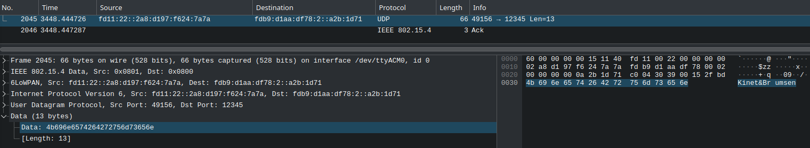

# Séance 1
## 1. Analyse du projet Blinky

```C
/* 
Bibliothèques de base + zephyr 
zephyr est le « real time operationg system » utilisé pour configurer le Dongle Nordic
*/
#include <stdio.h>
#include <zephyr/kernel.h>
#include <zephyr/drivers/gpio.h>

// Crée une variable constante d'une seconde 
#define SLEEP_TIME_MS   1000

// Crée un alias pour la led
#define LED0_NODE DT_ALIAS(led0)

// Cette commande permet la récupération de la configuration GPIO de la led.
static const struct gpio_dt_spec led = GPIO_DT_SPEC_GET(LED0_NODE, gpios);

// Fonction principale
int main(void)
{
    int ret;
    bool led_state = true;

	// Vérifier si la led est prête à être utilisée 
    if (!gpio_is_ready_dt(&led)) {
        return 0;
    }

    /*
    Prépare le led à être configuré comme output avec vérification en cas d'échec de la configuration.
    */
    ret = gpio_pin_configure_dt(&led, GPIO_OUTPUT_ACTIVE);
    if (ret < 0) {
        return 0;
    }

    while (1) {
		/* 
		Fait alterner l'état de la DEL GPIO et met fin au programme en cas d'erreur.
		*/
        ret = gpio_pin_toggle_dt(&led);
        if (ret < 0) {
            return 0;
        }

        led_state = !led_state;
        printf("LED state: %s\n", led_state ? "ON" : "OFF");
		// "Sleep" 1 s 
        k_msleep(SLEEP_TIME_MS);
    }
    return 0;
}
```
### Bonus
``` C
#include <stdio.h>
#include <zephyr/kernel.h>
#include <zephyr/drivers/gpio.h>

#define LED0_NODE DT_ALIAS(led0)

/* 
Création d'un alias pour le boutton, le sw0 à été obtenu dans
la documentation du laboratoire.
*/
#define BUTTON_1 DT_ALIAS(sw0)

static const struct gpio_dt_spec led = GPIO_DT_SPEC_GET(LED0_NODE, gpios);

/* 
Initialisation du bouton de façon similaire à celle utilisée précédemment pour la LED.
Cette commande permet la récupération de la configuration GPIO du boutton.
*/
static const struct gpio_dt_spec button = GPIO_DT_SPEC_GET(BUTTON_1, gpios);

int main(void)
{
    int ret;
    int button_state;

    if (!gpio_is_ready_dt(&led)) {
        return 0;
    }

	/*
	Vérification si le boutton est pret à étre utilisé 
	*/
    if (!gpio_is_ready_dt(&button)) {
        return 0;
    }

    /*
    Prépare le bouton à étre configuré comme input avec vérification en cas d'échec de la configuration.
    */
    ret = gpio_pin_configure_dt(&led, GPIO_OUTPUT);
    
    if (ret < 0) {
        return 0;
    }
    ret = gpio_pin_configure_dt(&button, GPIO_INPUT);
    if (ret < 0) {
        return 0;
    }

	/*
	L'état du bouton est lu et refleté dans la led 
	*/
    while (1) {
        button_state = gpio_pin_get_dt(&button);
        if (button_state < 0){
	        return 0
	    else :
            ret = gpio_pin_set_dt(&led,button_state);
        }
    }
    return 0;
}
```
### Mémoire
Nous pouvons observer 3 zones dans la clé :
- Le MBR (Orange)
- Le Bootloader (Rouge)
Le bootloader comporte 2 modes de fonctionnement:
- Flashing "BootLoader Mode" (Permet le chargement d'une application en mémoire)
- Booting 


- L'Application (Vert)


L'application contient :
- Kernel
- Drivers
- Code

Elle commence généralement à 0x1000.
# Séance 2
## Configuration et Test du nRF Thread Topology Monitor
### Installation d'une Image

Pour installer une image sur notre nRF52840, nous avons découvert dans la documentation que le fichier tar.gz contient un répertoire nommé "hex". Ce répertoire regroupe toutes les images nécessaires pour différents matériels compatibles.

Nous avons choisi l'image suivante :
*nrf52840_xxaa_mbr_pca10059_usb.hex*
car nous utilisons un nRF52840 Dongle (PCA10059).
### Installation des Outils
Sous Linux, nous avons téléchargé le fichier tar.gz depuis le site officiel de Nordic Semiconductor :
https://www.nordicsemi.com/Products/Development-tools/nRF-Thread-topology-monitor/Download

Cependant, lors de l'exécution de l'application, nous avons rencontré l'erreur suivante :
`libgconf-2.so.4: cannot open shared object file: No such file or directory.`

Ce problème a été résolu en installant GConf à l'aide de la commande :
`yay -S gconf `
### Configuration des Outils
Nous avons configuré un PAN ID unique pour notre groupe et assigné les paramètres suivants :
- Canal : 11
- PAN ID : 24AA
- Clé principale (master key) : 00112233445566778899aabbccddeeff
### Situation Initiale
Dans notre réseau Thread, nous avions 4 appareils connectés. Les rôles dans un réseau Thread sont les suivants :
- End Device (noir) : Communique uniquement avec son routeur parent.
- Thread Router (bleu) : Appareil jouant le rôle de routeur au sein du réseau.
- Thread Leader (orange) : Routeur désigné dynamiquement pour gérer et coordonner le réseau Thread.
### Critères pour sélectionner un Leader :
1. Poids du Leader :
    Calculé en fonction des ressources disponibles (mémoire, énergie) et du rôle actuel dans le réseau. Un appareil alimenté sur secteur ou mieux intégré sera favorisé.
2. ID de Routeur :
    En cas d’égalité de poids, l’appareil avec le plus petit ID devient Leader.
3. Absence de Leader :
    Si aucun Leader n’existe, une nouvelle élection est déclenchée automatiquement.
### **Nombre maximum de machines sur un réseau Thread :**


Plus d'informations sur les rôles :
[https://openthread.io/guides/thread-primer/node-roles-and-types](https://openthread.io/guides/thread-primer/node-roles-and-types "https://openthread.io/guides/thread-primer/node-roles-and-types")

Dans notre configuration initiale, notre appareil a été désigné comme leader et et le réseau est configuré en topologie full mesh (tous les routeurs sont connectés les uns aux autres), fournissant une redondance élevée:

### Test de la Topologie
Pour tester le comportement de la topologie Thread, nous avons éloigné l'appareil jouant le rôle de Leader. Cela nous a permis d'observer les réactions dynamiques du réseau, notamment la redistribution des rôles.
#### Absence du Leader
Lorsque le Leader quitte la topologie, les autres appareils continuent de communiquer en attendant une réélection :

Pendant cette période de transition, le réseau continue de fonctionner, bien que des limitations temporaires puissent survenir:
- Les end devices peuvent toujours communiquer avec leurs routeurs parents respectifs et la transmission des données au sein du réseau est maintenue.
- Les opérations dépendant des fonctions spécifiques du leader, telles que l'attribution de nouveaux routeur ID ou le traitement des demandes émanant de end devices éligibles au rôle de routeur (REED), sont interrompues jusqu'à l'élection d'un nouveau leader.
#### Réélection d'un nouveau Leader
Apres un certain délai, un nouveau Leader est élu parmi les routeurs disponibles :


#### Child
un « Child » est une machine qui n'a accès au réseau que par le biais d'une connexion avec son parent.
Voici un exemple wireshark d'une nouvelle connection sur le réseau par un enfant :

- Une carte démarre en mode **End Device**.
- Lorsqu’elle détecte que le réseau a besoin d’un routeur, elle envoie des messages **MLE Parent Request** pour établir une connexion avec un Leader.
- Si le réseau valide la candidature, la carte devient routeur en utilisant l'id donné par le leader.
- Le nouveau router se met à envoyer des annonces **MLE Advertisement**.

Si le parent d'un enfant est déconnecté du réseau, trois cas de figures se présentent:
- l'enfant n'arrive pas à joindre les autres appareils: il est déconnecté lui aussi.
- l'enfant se voit réattribué un autre parent.
- l'enfant est promu à l'état de routeur.
## Analyse réseau avec Wireshark

### Installation et configuration des outils :
[https://docs.nordicsemi.com/bundle/ug_sniffer_802154/page/UG/sniffer_802154/intro_802154.html](https://docs.nordicsemi.com/bundle/ug_sniffer_802154/page/UG/sniffer_802154/intro_802154.html "https://docs.nordicsemi.com/bundle/ug_sniffer_802154/page/UG/sniffer_802154/intro_802154.html")

Pour cette étape nous avons gardé le groupe précédent et suivi les consignes de la documentation.
1. Installation du module sniffer
2. Configuration de Wireshark avec une clé de déchiffrement

Configuration CLI en série:
https://open4tech.com/openthread-cli-example/
### Analyse réseau
#### Décrivez brièvement 6LoWPAN ?
6LoWPAN est un acronyme pour « IPv6 Low power Wireless Personal Area Networks », un protocole permettant l'échange de paquets IPv6 entre des appareils aux ressources limitées, grâce à ses normes de compression.

Voici ce qui se passe à chaque couche concernée, de bas en haut :
- L1 (Physical) : La radio IEEE 802.15.4 gère la transmission sans fil.
- L2 (Data Link) : IEEE 802.15.4 MAC gérant la transmission des paquets de base et l'accès au channel.
- L3 (Network) : Couche d'adaptation 6LoWPAN compressant IPv6 → Thread gérant le routage et le réseau maillé
- L4-7 : Thread fournissant divers services de réseau et support d'application
#### Etablissement des liens :


1. Le nouveau routeur envoie une demande d'association en multicast aux routeurs voisins.
2. Les routeurs répondent par des messages d'acceptation et de demande d'association.
3. Le nouveau routeur répond à chaque routeur par une instruction unicast Link Accept pour établir la liaison routeur-routeur.
#### Adresses données par ipaddr
Types :
Link-Local Address (LLA) : 
- Toutes les interfaces accessibles par une seule transmission radio
- Utilisée pour découvrir les voisins, configurer les liens et échanger des informations de routage.
- N'est pas une adresse routable
- A toujours un préfixe de `fe80::/16`

Mesh local : 
- Toutes les interfaces accessibles au sein du même réseau Thread
- Ne change pas en fonction de la topologie
- Doit être utilisé par les applications
- A toujours un préfixe `fd00::/8`

Routing Locator (RLOC) :
- Généré dès qu'un appareil se connecte à un réseau
- Pour délivrer des datagrammes IPv6 au sein d'un réseau Thread
- Change au fur et à mesure que la topologie change
- N'est généralement pas utilisé par les applications

Anycast Locator (ALOC) :
- Identifie une interface de fil via la recherche RLOC, lorsque le RLOC d'une destination n'est pas connu.
- fcXX = destination ALOC, qui recherche le RLOC approprié
- N'est généralement pas utilisé par les applications

Global : 
- Toutes les interfaces accessibles depuis l'extérieur d'un réseau Thread
- Une adresse IPv6 publique
- A toujours un préfixe de `2000::/3`

La commande `ipaddr` liste toutes les adresses IPv6 attribuées à l'interface Thread.


Les préfixes nous permettent d'identifier les types d'interfaces suivantes:
```
fdde:ad00:beef::ff:fe00:6800          # RLOC
fdde:ad00:beef::e294:7a7f:ab01:893f   # ML-EID
fe80::e01e:8ae0:32ce:6218             # LLA
```
Si notre machine était leader voici un résultat possible :

#### Types de paquets MLE :

1. Link request:
- Initie l'établissement d'une liaison entre deux appareils
- Envoi d'une demande de connexion initiale
- Inclut les caractéristiques de l'appareil et les informations d'identification
- Sonde les appareils voisins potentiels pour la connectivité

2. Link Accept :
- Réponse à une demande de liaison réussie
- Confirme l'établissement de la liaison
- Échange de détails supplémentaires sur la configuration du réseau
- Valide la capacité de l'appareil à rejoindre le réseau

3. Parent Request : 
- Envoyé par un end device cherchant à rejoindre le réseau
- Demande d'affectation à un routeur parent
- Inclut les exigences de configuration du réseau de l'appareil
- Recherche d'un routeur approprié pour la connexion au réseau

4. Parent Response : 
- Envoyé par les routeurs parents potentiels
- Fournit des informations sur la jonction des réseaux
- Comprend :
	-> les paramètres du réseau du routeur
	-> Qualité de la liaison
	-> Ressources disponibles
	-> Potentiel d'attachement des périphériques

5. Advertisement :
- Diffusé périodiquement par les routeurs
- Annonce la disponibilité du réseau
- Fournit des détails sur la configuration du réseau
- Aide les nouveaux appareils ou les appareils itinérants à découvrir le réseau

6. Child ID Request :
- Envoyée après la sélection du parent
- Demande d'adhésion officielle au réseau
- Fournit une configuration spécifique à l'appareil
- Demande la confirmation finale de l'attachement au réseau

7. Child ID Response
- Confirme l'appartenance du dispositif enfant au réseau
- Attribue des identifiants spécifiques au réseau
- Achève le processus d'intégration du dispositif
- Fournit les détails de la configuration finale du réseau
#### Enfant dans le réseau via CLI
1. Définissez le nom du réseau : `networkname OpenThread` 
2. Définissez l'ID XPAN : `extpanid dead00beef00cafe` 
3. Définissez le canal : `channel 11` 
4. Définissez l'ID PAN : `panid 0x24aa` 
5. Définir la clé de réseau : `networkkey 00112233445566778899aabbccddeeff` 
6. Démarrez l'interface IPv6 : `ifconfig up` 
7. Démarrez l'opération du protocole Thread : `thread start` 
8. Changer l'état actuel :`state child`
9. Obtenir le rôle actuel de la machine Thread : `state`

Analyse des paquets:
- *MLE Parent Request* envoyé pour se connecter à un router parent.
- Réponse avec des messages *MLE Parent Response* du routeur parent


### Send UDP
#### Configuration
##### Node 1:
Sur le Node 1, ouvrez et liez le socket UDP.  
```
udp open
udp bind :: 1234
```
Le :: spécifie que l'adresse IPv6 est non spécifiée (équivalent au 0.0.0.0 en IPv4).
##### Node 2:
Sur le nœud 2, ouvrez le socket UDP et envoyez un message simple.
```
udp open
udp send fdde:ad00:beef:0:0:ff:fe00:6800 1234 hello
```
#### Observation
Dans Wireshark, les paquets UDP apparaissent avec le port source 1234 et contiennent le message envoyé.

### COAP
#### Comparaison CoAP vs MQTT

| Critères               | **COAP**                                            | **MQTT**                  |
| ---------------------- | --------------------------------------------------- | ------------------------- |
| Architecture supportée | HTTP-like (REST)                                    | PUB/SUB                   |
| Transport              | UDP                                                 | TCP                       |
| Confirmations          | Supporte les messages confirmables/non-confirmables | Fiabilité assurée par TCP |
| Efficacité             | Léger, idéal pour IoT à faible bande passante       | Plus lourd, nécessite TCP |


#### Différence GET/PUT CoAP
##### Node 1 (server)
```
> coap start 
Done 
> coap resource test 
Done 
> coap request from fdde:ad00:beef:0:0:ff:fe00:cc00 PUT with payload: 68656c6c6f6e6f6e636f6e 
coap request from fdde:ad00:beef:0:0:ff:fe00:cc00 GET 
coap response sent 
coap request from fdde:ad00:beef:0:0:ff:fe00:cc00 PUT with payload: 68656c6c6f636f6e
coap response sent 
coap request from fdde:ad00:beef:0:0:ff:fe00:cc00 GET 
coap response sent
```
##### Get avec confirmation :
`coap get fdde:ad00:beef:0:0:ff:fe00:6800 test -c`
Dans Wireshark, on observe :
- Bit de confirmation à 1
- Un paquet « content » contenant les données relatives aux ressources est également visible.


##### Get sans confirmation :
`coap get fdde:ad00:beef:0:0:ff:fe00:6800 test`
Dans Wireshark, on observe :
- Bit de confirmation à 0
- Un paquet « content » contenant les données relatives aux ressources est également visible.


##### Put avec confirmation :
`coap put fdde:ad00:beef:0:0:ff:fe00:6800 test -c`
Dans Wireshark, on observe :
- Bit de confirmation à 1
- Une réponse ACK est envoyée


##### Put sans confirmation :
`coap put fdde:ad00:beef:0:0:ff:fe00:6800 test`
Dans Wireshark, on observe :
- Bit de confirmation à 0
- Pas de paquets ACK de confirmation


# Séance 3
## Build de l’image custom

Étant le sniffer, nous n'avons pas eu à construire une image personnalisée, mais voici comment nous l'aurions fait si cela avait été nécessaire:
### Processus de build
1. Récupération du sample dans le SDK
2. Configuration de l'image
3. Construction du .hex
4. Transfert de l'application sur la carte en utilisant nRF Programmer
## Commissioner
Le rôle du commissioner est de faciliter l'ajout de nouveaux nœuds au réseau Thread, en ne demandant qu'un mot de passe pour rejoindre le réseau. Une fois ce mot de passe fourni, le commissionner envoie sur un canal sécurisé les détails du réseau Thread.
### Démarrage du Commissioner :
```bash
uart:~$ ot dataset init new
Done
uart:~$ ot dataset commit active
Done
uart:~$ ot ifconfig up
Done
uart:~$ ot thread start
Done
uart:~$ ot commissioner start
Done
uart:~$ ot commissioner joiner add f4ce36a3523bb60f N0RD1C
```
### Démarrage du Joiner :
```bash
uart:~$ ot eui64 f4ce36a3523bb60f 
Done 
uart:~$ ot joiner start N0RD1C
```
### Observation sur WireShark :
Session DTLS (Datagram Transport Layer Security) après réception et réponse au Discovery Request. Durant cette session, on échange les credentials de manière sécurisée afin que l'appareil puisse rejoindre le réseau Thread.


Ensuite, le joiner fait `ot thread start` pour rejoindre le réseau.
#### Petitioning 
Le petitioning se déroule en deux phases :
1. (Commissioning externe uniquement) Le potentiel Commissioner échange un handshake d’authentification DTLS avec le Thread Border Router pour prouver son éligibilité et établir une connexion sécurisée.
2. (Les deux scénarios) Le potentiel Commissioner envoie une pétition au Thread Leader via le Border Router.
Le Leader accepte la pétition en fonction d'un seul critère : l'existence ou non d'un commissioner actif dans le réseau Thread.
Si elle est rejetée, un message de rejet est envoyé avec l'ID du commissaire actif.

Une fois la demande acceptée par le leader, les actions suivantes ont lieu :
1. (Commissioning externe uniquement) La connexion est établie et toutes les communications entre le commissaire et les autres participants se font par l'intermédiaire du Border Agent.
2. (Les deux scénarios) Le nouveau commissaire devient le seul commissaire autorisé.
3. (Les deux scénarios) Un message périodique est envoyé pour maintenir la session ouverte.

Dans notre situation, le Commissioner est le Leader, il n'y a donc pas de Petitioning à attraper sur wireshark.
#### Joining 
Cela se produit dans les deux scénarios (Commissioning interne ou externe) :
1. Le Joiner, envoie un message de Discovery Request sur chaque channel.
2. Le Joiner Router reçoit ce message et répond avec un message de Discovery Response, contenant les identifiants du réseau et les steering data dans le payload.
3. Le Joiner utilise les informations reçues pour identifier le réseau auquel se connecter.

## OTBR
Un routeur OpenThread Border (OTBR) relie le réseau Thread à internet, permettant aux appareils du réseau Thread de communiquer avec des services externes.
### Ping
On voit l'envoi, des ack et le reply de l'addresse synthétisée lors du 6to4:


Commandes dans le CLI:
```bash
uart:~$ ot ping 10.43.29.113
Pinging synthesized IPv6 address: fdb9:d1aa:df78:2:0:0:a2b:1d71
16 bytes from fdb9:d1aa:df78:2:0:0:a2b:1d71: icmp_seq=1 hlim=63 time=15ms
1 packets transmitted, 1 packets received. Packet loss = 0.0%. Round-trip min/avg/max = 15/15.0/15 ms.
Done
```
**Comment peut-on pinger une adresse IPv4 alors que Thread utilise de l'IPv6 ?**
- Le mécanisme NAT64 permet cette conversion entre les protocoles IPv6 et IPv4. Le Border Router utilise ce mécanisme pour relayer les paquets IPv6 à travers un réseau IPv4.

**Qu’est-ce que l’adresse Off-Mesh Routable (OMR) ?**
- L’adresse **OMR** permet à un nœud du réseau Thread de communiquer avec des services externes via le Border Router, en agissant comme une adresse routable hors du réseau Thread.

**Expliquer le rôle de ces adresses IP**
Voir Séance 2
```
fd11:22:0:0:3e52:4e4b:45cb:87e2           # OMR
fe80:0:0:0:786b:e8fc:b690:c72             # LLA
fdb1:2403:1b00:f1a5:0:ff:fe00:fc11        # ALOC
fdb1:2403:1b00:f1a5:0:ff:fe00:fc10        # ALOC
fdb1:2403:1b00:f1a5:0:ff:fe00:fc38        # ALOC
fdb1:2403:1b00:f1a5:0:ff:fe00:fc0         # ALOC
fdb1:2403:1b00:f1a5:0:ff:fe00:b000        # RLOC
fdb1:2403:1b00:f1a5:40a:27a8:a9ed:8eae    # ML-EID
```
### UDP
On remarque que le ack correspond au done, et que on fait bien du 6to4 
```bash
uart:~$ ot udp send 10.43.29.113 12345 Kinet&Brumsen 
Sending to synthesized IPv6 address: fdb9:d1aa:df78:2:0:0:a2b:1d71 
Done
```


### SRP
SRP et mDNS permettent de découvrir et d'enregistrer des services dans le réseau Thread.
- mDNS (Multicast DNS) : permet la résolution de noms de domaine sur le réseau local sans serveur DNS centralisé.
- SRP (Service Registration Protocol) : Permet d'enregistrer des services dans le réseau, ce qui facilite leur découverte par d'autres nœuds.
#### Configuration
```bash
> srp client host name BrumsenKinet
Done
```
Définir le nom de l'hôte
```bash
> srp client service add ins1 _thread._tcp 12345
Done
```
Ajouter un service avec un nom d'instance, un nom de service, un numéro de port.
```bash
> srp client start <serveraddr> <serverport>
Done
```
Démarrer le client SRP avec une adresse IPv6 et un numéro de port.
